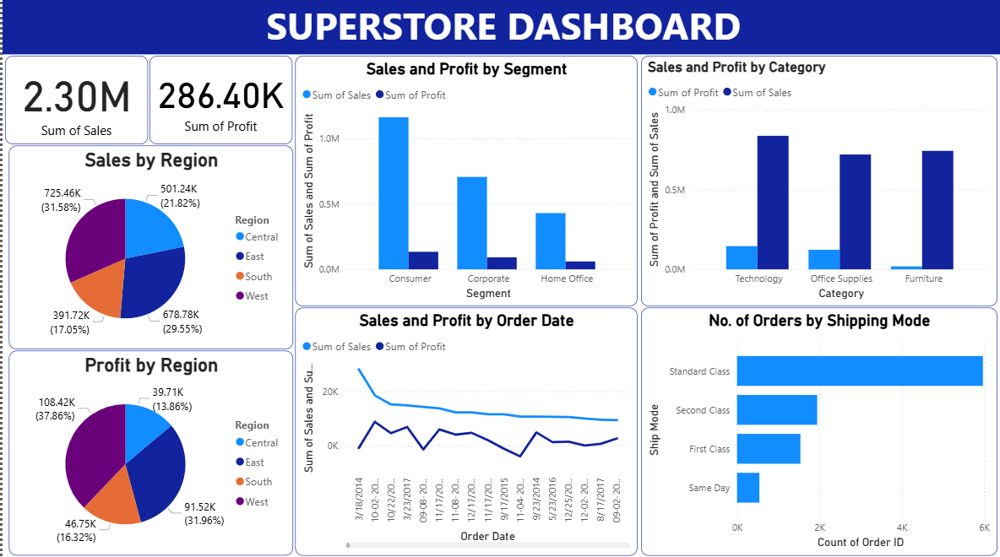

# 🛒 Superstore Dashboard - Power BI Project



## 📊 Project Description

This Power BI dashboard provides a comprehensive visualization of sales and profit data for a Superstore. The data has been analyzed across various dimensions such as Region, Segment, Category, Shipping Mode, and Order Date.

---

## 📁 Dataset

- **File**: `4superstore.xlsx`
- The dataset includes:
  - Sales
  - Profit
  - Order Date
  - Shipping Mode
  - Region
  - Segment
  - Category

---

## 📈 Dashboard Highlights

- 💰 **Total Sales**: 2.30M  
- 📈 **Total Profit**: 286.40K  
- 📍 **Sales and Profit by Region** (Pie Charts)  
- 👥 **Sales and Profit by Segment**  
- 🗂️ **Sales and Profit by Category**  
- 📦 **No. of Orders by Shipping Mode**  
- 🗓️ **Sales and Profit Trends by Order Date**  

---

## ⚙️ Tools Used

- **Microsoft Power BI**
- **Excel (Data Source)**

---

## 🧩 Features

- Interactive and visual breakdown of key performance metrics.
- Region-wise, Segment-wise, and Category-wise comparisons.
- Trend analysis over time.
- Shipping performance insights.

---

## 🛠️ How to Use

1. Clone this repository:
   ```bash
   git clone https://github.com/OmkarP1919/PowerBI-Dashboard.git
